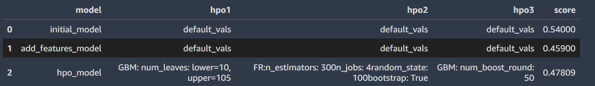
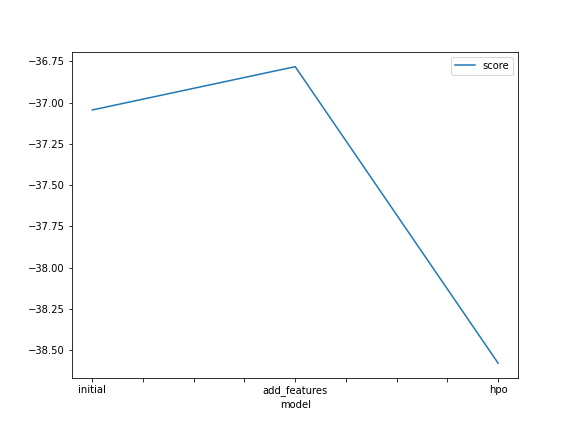

# Report: Predict Bike Sharing Demand with AutoGluon Solution
#### Barbara Cardoso

## Initial Training
### What did you realize when you tried to submit your predictions? What changes were needed to the output of the predictor to submit your results?
The first time without sapareting the date from hour the performance of the model was not so good, but improve with the data split. 

### What was the top ranked model that performed?
TODO: Add your explanation

## Exploratory data analysis and feature creation
### What did the exploratory analysis find and how did you add additional features?
For the extra features I divided the datetime in month, day, year and hour. Also it was usefull to transform the season and weather features to categorical and plot the categorical histogram.

### How much better did your model preform after adding additional features and why do you think that is?
It did improve the score because additional features can be good predictors to estimate the target value, in this case I decided to separate the date becuase it helps the model to analyse seasonality paterns in the data which can be usefull for a regression model.

## Hyper parameter tuning
### How much better did your model preform after trying different hyper parameters?
Hyper parameter tuning with RF did improve model performance, comparing with NN model.

### If you were given more time with this dataset, where do you think you would spend more time?
Do a more extensive data analysis in order to get more information about this dataset, so this wey I could decide witch model and hiperparameters would result in a better trained model.

### Create a table with the models you ran, the hyperparameters modified, and the kaggle score.
|model|hpo1|hpo2|hpo3|score|
|--|--|--|--|--|
|initial|default_vals|default_vals|default_vals|0.54023|
|add_features|default_vals|default_vals|default_vals|0.46916|
|hpo|regression|'GBM: num_boost_round: 100'|'FR:n_estimators: 300'|0.47809|

### Create a line plot showing the top model score for the three (or more) training runs during the project.

TODO: Replace the image below with your own.

### Create a line plot showing the top kaggle score for the three (or more) prediction submissions during the project.

TODO: Replace the image below with your own.

## Summary
TODO: Add your explanation
